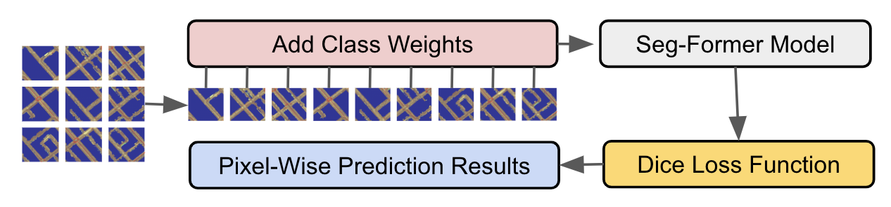

# Road Marking Classification

This project is part of the larger initiative titled **Segment and Classify Road Paint Lines/Markings from LiDAR Raster Images**.  
My contribution focuses on the **pixel-level segmentation and classification** of road markings using deep learning models, specifically **SegFormer** for semantic segmentation tasks.  
The dataset, consisting of high-resolution TIFF images and corresponding SHP labels, is provided by Tetra Tech, who also proposed the project.

## Models Used

**SegFormer (from HuggingFace)**, which is a segmented and transformer-based model for pixel-level segmentation and classification

## Fine-tune Process 


- **Input**: Segmented Pavement Image
- **Output**: Pixel-level probability


## Training Highlights

- **Patch-based design** to capture fine details and spatial context in large images
- **Class weighting** to mitigate class imbalance
- **Dice loss** to enhance fine-detail structures


## Project Structure
| File/Folder           | Description                                                |
|------------------------|------------------------------------------------------------|
| `config.py`            | Configuration file containing hyperparameters and paths.   |
| `dataset_loader.py`        | Custom dataset loader module.                              |
| `split_dataset.py`     | Script for splitting the dataset into training/validation sets. |
| `data_preprocessor.py`  | Preprocessing tools for dataset management and preparation. |
| `train.py`             | Model training script.                                     |
| `inference.py`        | Model evaluation and testing script.                      |
| `utils.py`             | Utility functions (metrics calculation, visualization, etc.). |
| `requirements.txt`     | Python packages required to run the project.               |
| `run.sh`     | Shell script to execute training and inference.               |

## Environment
This project was developed and tested with:

- Python 3.10.15
- Other dependencies listed in `requirements.txt`  

   `pip install -r requirements.txt`

## How to Run
### 1. Prepare Dataset Folder
Before running any scripts, make sure to create a 'dataset/' directory to store the raw data

### 2. split the dataset
   Run the dataset splitting script to create training and validation sets:
   `python split_dataset.py`

### 3. Train and Inference
   ```bash
   run.sh
   ```
**Configuration**  
   You can modify paths and hyperparameters in `config.py` as needed.
