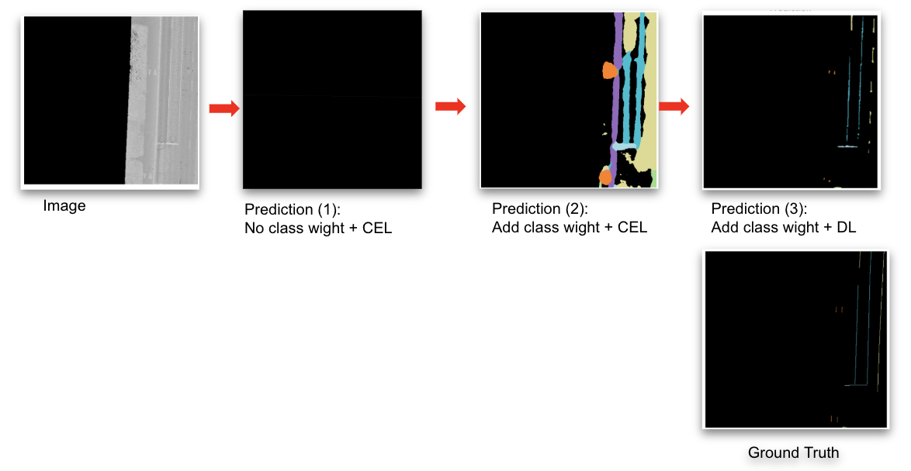

# Road Marking Classification

This project focuses on pixel-level segmentation and classification of road markings using deep learning models such as **SegFormer** for semantic segmentation and classification. The dataset is derived from high-resolution TIFF images and corresponding SHP labels.

## Models Used

**SegFormer (from HuggingFace)**, which is a segmented and transformer-based model for pixel-level segmentation and classification

## Fine-tune Process 

- **Input**: Segmented Pavement Image
- **Output**: Pixel-level probability

## Training Highlights

- **Patch-based design** to capture fine details and spatial context in large images
- **Class weighting** to mitigate class imbalance
- **Dice loss** to enhance fine-detail structures

## Result

**Our fine-tuned model (Prediction 3) shows progressive improvement through training strategies**:
- Prediction (1): road markings largely missed.
- Prediction (2): better class recognition, but poor edge precision.
- Prediction (3): detailed and accurate predictions resembling the ground truth.

## Project Structure
| File/Folder           | Description                                                |
|------------------------|------------------------------------------------------------|
| `config.py`            | Configuration file containing hyperparameters and paths.   |
| `DataLoader.py`        | Custom dataset loader module.                              |
| `DatasetProcessor.py`  | Preprocessing tools for dataset management and preparation. |
| `split_dataset.py`     | Script for splitting the dataset into training/validation sets. |
| `utils.py`             | Utility functions (metrics calculation, visualization, etc.). |
| `requirements.txt`     | Python packages required to run the project.               |
| `train.py`             | Model training script.                                     |
| `ModelsTest.py`        | Model evaluation and testing script.                      |

## How to Run
**Split the dataset**  
   Run the dataset splitting script to create training and validation sets:
   `python split_dataset.py`

**Train the model**  
   Start model training:  
   `python train.py`

**Test the model**  
   Evaluate the model after training:  
   `python ModelsTest.py`

 **Configuration**  
   You can modify paths and hyperparameters in `config.py` as needed.

# Add draft
dataset is provided by Tetra Tech
